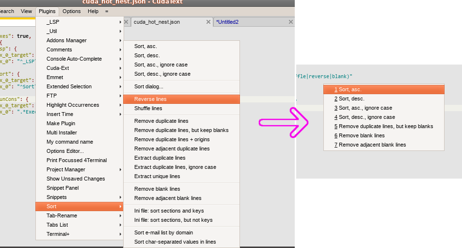

# Nested Hotkeys (WIP)

CudaText plugin - to create custom menus that can be bound to hotkeys


At the moment it is only possible to filter commands with regular expressions.

### creating custom menu

* Open config file From the main menu: "Options > Settings-plugins > Nested Hotkeys > Config"
* List existing commands: "Options > Settings-plugins > Nested Hotkeys > View commands"
* Add menu config to `menus` category in the config file

Example of config:
```
{
  ...
  "menus": {
    "hot--Sort": {
      "regex_0_target": "p_caption",
      "regex_0": "^Sort\\\\.*(Sort,|shuffle|reverse|blank)"
    }
    ...
  }
}
```

Where `regex_n_target` - dictinary key of a command from commands list.
And `hot--Sort` - will be the name of new command in Command Palette
